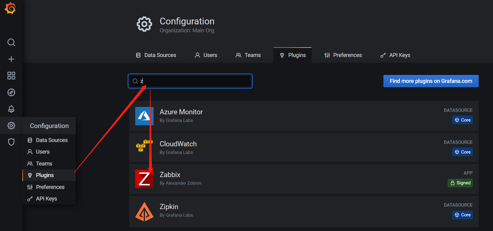

## 安装

访问 [官网](https://grafana.com/grafana/download) ，根据自己环境进行安装

```shell
# 安装
wget https://dl.grafana.com/oss/release/grafana-7.1.0~beta3-1.x86_64.rpm
yum install grafana-7.1.0~beta3-1.x86_64.rpm

# 重启
systemctl restart grafana-server
```

默认账号 

## 修改配置

```shell
# 位置
/etc/grafana/grafana.ini

# 配置mysql数据库
create database grafana DEFAULT CHARACTER SET utf8 COLLATE utf8_general_ci;
GRANT ALL ON grafana.* TO grafana@'%' IDENTIFIED BY 'grafana' WITH GRANT OPTION;
# 修改为mysql为数据源
[database]
type = mysql
host = 127.0.0.1:3306
name = grafana
user = grafana
password = grafana

# grafana7没有找到以下session配置位置
# 创建session表
CREATE TABLE `session` (
    `key`       CHAR(16) NOT NULL,
    `data`      BLOB,
    `expiry`    INT(11) UNSIGNED NOT NULL,
    PRIMARY KEY (`key`)
) ENGINE=MyISAM DEFAULT CHARSET=utf8;
# 使用mysql存储session
[session]
provider = mysql
provider_config = grafana:grafana@tcp(127.0.0.1:3306)/grafana
cookie_name = grafana_sess
cookie_secure = false
session_life_time = 86400
```

## 开放端口

```shell
yum install iptables-services
iptables -I INPUT -p tcp --dport 3000 -j ACCEPT
service iptables save
systemctl restart  iptables.service
```

## zabbix 插件

访问官网[插件中心](https://grafana.com/grafana/plugins)，搜索zabbix

点击获取下载安装说明

```shell
grafana-cli plugins install alexanderzobnin-zabbix-app
# 重启
service grafana-server restart
```

访问http://ip:3000，进插件，开启zabbix



修改配置文件 `/etc/grafana/grafana.ini`

```shell
[plugins]
allow_loading_unsigned_plugins = alexanderzobnin-zabbix-datasource
```

## 友情提示

如果安装zabbix插件后，没有修改相应配置文件，可能会出现数据源处不显示。
